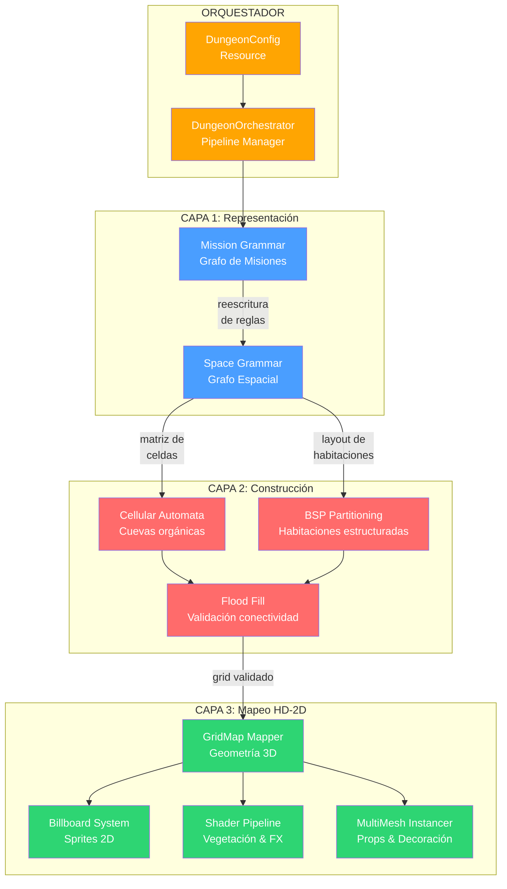

# Generador Procedural de Mazmorras HD-2D — Plan de Implementación

## Resumen Ejecutivo

Módulo de generación procedural de mazmorras para **Dungeon Divers** (Godot 4.6, Forward Plus, Jolt Physics, D3D12). El sistema implementa el marco de tres capas de Van der Linden et al. — **Representación → Construcción → Mapeo** — con control basado en gameplay mediante gramáticas de misiones (Dormans), garantizando mazmorras "ganables" antes de comprometer geometría.

> [!IMPORTANT]
> Este plan está estructurado en **6 fases incrementales** con entregables verificables. Cada fase produce un módulo funcional e independiente que puede probarse en aislamiento.

---

## User Review Required

> [!WARNING]
> **Decisiones de arquitectura que requieren tu aprobación:**
> 1. **Lenguaje del Core Logic**: El plan propone **GDScript puro** para el Core Logic Engine. La alternativa es C++ vía GDExtension para rendimiento máximo, pero aumenta significativamente la complejidad del build pipeline. ¿Priorizar velocidad de iteración (GDScript) o rendimiento bruto (C++)?
> 2. **Tamaño de GridMap**: ¿Cuál es el rango de tamaño esperado para las mazmorras? (e.g., 32×32, 64×64, 128×128 celdas). Esto impacta las decisiones de chunking y threading.
> 3. **Cámara isométrica**: ¿Ya tienes definido el ángulo de cámara y la proyección? (ortográfica vs perspectiva). Esto afecta el shader de billboarding.

## Preguntas Abiertas

> [!NOTE]
> 1. ¿Existen assets de MeshLibrary ya preparados (tiles de suelo, muros, decoraciones), o el módulo debe incluir tiles placeholder?
> 2. ¿El sistema de "cerraduras y llaves" debe soportar ítems genéricos o se mapeará a objetos específicos del inventario del jugador?
> 3. ¿Se requiere soporte para mazmorras multi-piso (conexión vertical entre niveles) en la primera versión, o es extensión futura?
> 4. ¿Existe ya un sistema de navegación/pathfinding que el generador deba alimentar (NavigationRegion3D, AStarGrid2D)?

---

## Arquitectura del Sistema



---

## Estructura de Directorios del Proyecto

```
res://
├── src/
│   ├── dungeon_generator/
│   │   ├── core/                          # CAPA 1 & 2: Lógica pura (sin dependencias de nodos Godot)
│   │   │   ├── data/
│   │   │   │   ├── cell_grid.gd           # Modelo de datos: matriz 2D con estados de celda
│   │   │   │   ├── dungeon_graph.gd       # Modelo de datos: grafo de misión/espacio (nodos + aristas)
│   │   │   │   ├── room_data.gd           # Struct: metadatos de habitación (bounds, tipo, misión)
│   │   │   │   └── mission_node.gd        # Struct: nodo de misión (acción, dependencias, estado)
│   │   │   ├── grammars/
│   │   │   │   ├── mission_grammar.gd     # Motor de reescritura: gramática de misiones
│   │   │   │   ├── space_grammar.gd       # Motor de reescritura: gramática espacial
│   │   │   │   └── grammar_rules.gd       # Catálogo de reglas de producción
│   │   │   ├── algorithms/
│   │   │   │   ├── cellular_automata.gd   # Generador de cuevas orgánicas
│   │   │   │   ├── bsp_partitioner.gd     # Binary Space Partition para habitaciones
│   │   │   │   ├── corridor_carver.gd     # Tallado de corredores entre habitaciones
│   │   │   │   └── flood_fill.gd         # Validación de conectividad
│   │   │   ├── solvers/
│   │   │   │   ├── winnability_solver.gd  # Verificador de "ganabilidad" del grafo
│   │   │   │   └── fitness_evaluator.gd   # Evaluador de calidad (GA micro-optimización)
│   │   │   └── dungeon_pipeline.gd        # Orquestador del pipeline completo (sin nodos)
│   │   │
│   │   ├── render/                        # CAPA 3: Mapeo a Godot (depende de nodos)
│   │   │   ├── gridmap_mapper.gd          # Traduce CellGrid → GridMap (set_cell_item)
│   │   │   ├── billboard_spawner.gd       # Instancia sprites 2D con billboarding
│   │   │   ├── multimesh_populator.gd     # Vegetación y decoración vía MultiMeshInstance3D
│   │   │   ├── navigation_baker.gd        # Rebake de NavigationRegion3D post-generación
│   │   │   └── chunk_manager.gd           # División en chunks para culling/LOD
│   │   │
│   │   ├── config/                        # Recursos exportables desde el editor
│   │   │   ├── dungeon_config.gd          # Resource: parámetros del generador
│   │   │   ├── biome_profile.gd           # Resource: perfil visual (meshes, colores, densidad)
│   │   │   └── difficulty_curve.gd        # Resource: curva de dificultad → profundidad de grafo
│   │   │
│   │   └── debug/                         # Herramientas de desarrollo
│   │       ├── dungeon_visualizer.gd      # Dibuja grafo de misión/espacio en 2D overlay
│   │       └── generation_profiler.gd     # Métricas de rendimiento y estadísticas
│   │
│   └── shaders/
│       ├── grass_multimesh.gdshader       # Shader de hierba con viento y color mixing
│       ├── billboard_sprite.gdshader      # Shader de billboarding Y-locked
│       └── wall_fade.gdshader             # Shader de transparencia dinámica de muros
│
├── scenes/
│   └── dungeon/
│       ├── dungeon_level.tscn             # Escena principal del nivel generado
│       └── dungeon_debug_view.tscn        # Vista de debug con overlay del grafo
│
├── resources/
│   ├── mesh_libraries/
│   │   └── dungeon_tiles.meshlib          # MeshLibrary del GridMap
│   ├── configs/
│   │   ├── cave_dungeon.tres              # Preset: cueva orgánica
│   │   ├── castle_dungeon.tres            # Preset: castillo estructurado
│   │   └── hybrid_dungeon.tres            # Preset: híbrido CA + BSP
│   └── biomes/
│       ├── forest_crypt.tres              # Bioma: cripta forestal
│       └── stone_ruins.tres               # Bioma: ruinas de piedra
│
└── tests/
    ├── test_cell_grid.gd                  # Unit test: operaciones de grid
    ├── test_mission_grammar.gd            # Unit test: reescritura de gramáticas
    ├── test_flood_fill.gd                 # Unit test: conectividad
    ├── test_winnability.gd                # Unit test: verificación de ganabilidad
    └── test_pipeline_integration.gd       # Integration test: pipeline completo
```

---

## Proposed Changes

### Fase 1: Modelos de Datos Puros (Core Foundation)

> **Objetivo**: Establecer las abstracciones de datos que todo el sistema consumirá. Cero dependencias de Godot nodes.

---

#### [NEW] [`cell_grid.gd`](file:///c:/Users/olivereld/Documents/dungeon-divers/src/dungeon_generator/core/data/cell_grid.gd)

Modelo de datos central: una matriz 2D tipada que representa el estado de cada celda de la mazmorra.

```gdscript
## Abstracción de rejilla 2D desacoplada del motor de renderizado.
## Cada celda almacena un enum CellType y metadatos opcionales.
class_name CellGrid
extends RefCounted

enum CellType {
    VOID = -1,      # Fuera de límites
    WALL = 0,       # Muro sólido
    FLOOR = 1,      # Suelo transitable
    DOOR = 2,       # Puerta / punto de conexión
    LOCKED_DOOR = 3,# Puerta que requiere llave
    STAIRS_UP = 4,  # Escaleras ascendentes
    STAIRS_DOWN = 5,# Escaleras descendentes
    SPAWN = 6,      # Punto de aparición del jugador
    OBJECTIVE = 7,  # Objetivo de misión
}

var width: int
var height: int
var _cells: PackedInt32Array   # Flat array para rendimiento
var _metadata: Dictionary      # Vector2i → Dictionary (datos extra por celda)

func _init(w: int, h: int, default: CellType = CellType.WALL) -> void: ...
func get_cell(pos: Vector2i) -> CellType: ...
func set_cell(pos: Vector2i, type: CellType) -> void: ...
func is_in_bounds(pos: Vector2i) -> bool: ...
func get_neighbors_4(pos: Vector2i) -> Array[Vector2i]: ...
func get_neighbors_8(pos: Vector2i) -> Array[Vector2i]: ...
func count_neighbors(pos: Vector2i, type: CellType, use_8: bool = true) -> int: ...
func set_metadata(pos: Vector2i, key: String, value: Variant) -> void: ...
func get_metadata(pos: Vector2i, key: String) -> Variant: ...
func duplicate_grid() -> CellGrid: ...
```

**Diseño clave**: `PackedInt32Array` flat (índice = `y * width + x`) para evitar el overhead de `Array[Array]` y permitir iteración rápida en bucles de Autómatas Celulares.

---

#### [NEW] [`dungeon_graph.gd`](file:///c:/Users/olivereld/Documents/dungeon-divers/src/dungeon_generator/core/data/dungeon_graph.gd)

Grafo dirigido genérico para representar tanto el grafo de misiones como el grafo espacial.

```gdscript
## Grafo dirigido con nodos tipados y aristas con metadatos.
## Usado por Mission Grammar (nodos = tareas) y Space Grammar (nodos = habitaciones).
class_name DungeonGraph
extends RefCounted

var _nodes: Dictionary    # int id → Dictionary {type, data, position}
var _edges: Array         # Array de {from: int, to: int, data: Dictionary}
var _next_id: int = 0

func add_node(type: StringName, data: Dictionary = {}) -> int: ...
func remove_node(id: int) -> void: ...
func add_edge(from_id: int, to_id: int, data: Dictionary = {}) -> void: ...
func remove_edge(from_id: int, to_id: int) -> void: ...
func get_node(id: int) -> Dictionary: ...
func get_successors(id: int) -> Array[int]: ...
func get_predecessors(id: int) -> Array[int]: ...
func find_nodes_by_type(type: StringName) -> Array[int]: ...
func find_subgraph(pattern: Array[Dictionary]) -> Array[Dictionary]: ...  # Para matching de gramáticas
func get_topological_order() -> Array[int]: ...
func is_reachable(from_id: int, to_id: int) -> bool: ...
func duplicate_graph() -> DungeonGraph: ...
```

---

#### [NEW] [`room_data.gd`](file:///c:/Users/olivereld/Documents/dungeon-divers/src/dungeon_generator/core/data/room_data.gd)

Struct inmutable que describe una habitación individual.

```gdscript
class_name RoomData
extends RefCounted

var id: int
var rect: Rect2i                   # Bounding box en coordenadas de grid
var room_type: StringName          # &"combat", &"puzzle", &"treasure", &"boss", &"corridor"
var mission_node_id: int = -1      # Referencia al nodo de misión asociado
var connections: Array[Vector2i]   # Puntos de conexión (puertas) en coordenadas de grid
var enemies: Array[Dictionary]     # Enemigos a spawnear [{type, pos, level}]
var loot_table: StringName         # Referencia a tabla de loot
var is_required: bool = true       # ¿Forma parte del camino crítico?
```

---

#### [NEW] [`mission_node.gd`](file:///c:/Users/olivereld/Documents/dungeon-divers/src/dungeon_generator/core/data/mission_node.gd)

Nodo semántico del grafo de misiones.

```gdscript
class_name MissionNode
extends RefCounted

enum ActionType {
    START,           # Punto de inicio
    EXPLORE,         # Explorar área
    FIND_KEY,        # Encontrar llave/objeto
    UNLOCK,          # Desbloquear puerta/mecanismo
    COMBAT,          # Encuentro de combate
    MINI_BOSS,       # Mini-jefe
    BOSS,            # Jefe principal
    PUZZLE,          # Puzzle ambiental
    TREASURE,        # Cofre de tesoro
    NPC_INTERACTION, # Diálogo/quest NPC
    GOAL,            # Objetivo final del nivel
}

var action: ActionType
var required_items: Array[StringName]    # Ítems necesarios para completar
var grants_items: Array[StringName]      # Ítems otorgados al completar
var difficulty_weight: float = 1.0       # Peso para la curva de dificultad
var is_optional: bool = false            # ¿Rama secundaria?
var room_type_hint: StringName = &""     # Sugerencia para el Space Grammar
```

---

### Fase 2: Motor de Gramáticas (Mission → Space)

> **Objetivo**: Implementar el sistema de doble gramática de Dormans. La misión dicta la arquitectura.

---

#### [NEW] [`grammar_rules.gd`](file:///c:/Users/olivereld/Documents/dungeon-divers/src/dungeon_generator/core/grammars/grammar_rules.gd)

Catálogo de reglas de producción para reescritura de grafos (find-and-replace sobre subgrafos).

```gdscript
## Cada regla define un patrón LHS (Left-Hand Side) a buscar en el grafo
## y un RHS (Right-Hand Side) con el que reemplazarlo.
class_name GrammarRules
extends RefCounted

## Estructura de una regla de producción
## {
##   "name": "lock_and_key",
##   "weight": 1.0,              # Probabilidad relativa de selección
##   "lhs": [                    # Patrón a buscar (subgrafo)
##     {"id": 0, "type": "TASK", "match_any": true},
##   ],
##   "lhs_edges": [
##     {"from": 0, "to": 1}
##   ],
##   "rhs": [                    # Reemplazo
##     {"id": 0, "type": "FIND_KEY", "data": {"grants_items": ["key_A"]}},
##     {"id": 1, "type": "UNLOCK", "data": {"required_items": ["key_A"]}},
##     {"id": 2, "type": "TASK", "data": {}},
##   ],
##   "rhs_edges": [
##     {"from": 0, "to": 1},
##     {"from": 1, "to": 2}
##   ]
## }

static func get_mission_rules() -> Array[Dictionary]: ...
static func get_space_rules() -> Array[Dictionary]: ...
```

**Reglas de misión incluidas**:

| Regla | LHS | RHS | Efecto |
|-------|-----|-----|--------|
| `linear_task` | `A → B` | `A → C → B` | Inserta tarea intermedia |
| `lock_and_key` | `A → B` | `A → [KEY] → [LOCK] → B` | Crea dependencia llave-cerradura |
| `branch_optional` | `A → B` | `A → B` + `A → [OPT] → B` | Añade rama opcional |
| `combat_gate` | `TASK` | `[COMBAT] → TASK` | Antepone combate como requisito |
| `boss_finisher` | `TASK → GOAL` | `TASK → [BOSS] → GOAL` | Inserta jefe antes del objetivo |
| `puzzle_shortcut` | `A → B → C` | `A → B → C` + `A → [PUZZLE] → C` | Atajo condicional |

---

#### [NEW] [`mission_grammar.gd`](file:///c:/Users/olivereld/Documents/dungeon-divers/src/dungeon_generator/core/grammars/mission_grammar.gd)

Motor de reescritura que transforma un grafo semilla `START → GOAL` en un grafo de misiones complejo.

```gdscript
class_name MissionGrammar
extends RefCounted

var _rng: RandomNumberGenerator
var _rules: Array[Dictionary]
var _max_iterations: int
var _target_depth: int          # Controlado por DifficityCurve

## Genera el grafo de misiones aplicando reglas iterativamente.
## El proceso termina cuando se alcanza target_depth o max_iterations.
func generate(config: DungeonConfig) -> DungeonGraph:
    # 1. Crear grafo semilla: START → GOAL
    # 2. Loop: seleccionar regla ponderada → find matching subgraph → apply rewrite
    # 3. Validar winnability tras cada iteración
    # 4. Retornar grafo final
    ...

## Selección de regla por ruleta ponderada
func _select_rule(applicable: Array[Dictionary]) -> Dictionary: ...

## Verifica que el grafo siga siendo resoluble tras un rewrite
func _validate_after_rewrite(graph: DungeonGraph) -> bool: ...
```

**Flujo de generación**:
```
Iteración 0: START ──────────────────── GOAL
Iteración 1: START → EXPLORE ────────── GOAL
Iteración 2: START → EXPLORE → COMBAT → GOAL
Iteración 3: START → FIND_KEY → UNLOCK → EXPLORE → COMBAT → BOSS → GOAL
                                  └──── TREASURE (opcional) ────┘
```

---

#### [NEW] [`space_grammar.gd`](file:///c:/Users/olivereld/Documents/dungeon-divers/src/dungeon_generator/core/grammars/space_grammar.gd)

Traduce el grafo de misiones en un grafo espacial (habitaciones y conexiones).

```gdscript
class_name SpaceGrammar
extends RefCounted

## Transforma el grafo de misión en un layout de habitaciones.
## Cada nodo de misión se convierte en una RoomData con dimensiones y posición.
func generate(mission_graph: DungeonGraph, config: DungeonConfig) -> Array[RoomData]:
    # 1. Asignar tipo de habitación según ActionType del nodo de misión
    # 2. Calcular dimensiones basadas en room_type y dificultad
    # 3. Posicionar habitaciones usando placement con detección de colisiones
    # 4. Generar corredores entre habitaciones conectadas en el grafo
    # 5. Retornar array de RoomData posicionadas
    ...

## Placement: intenta colocar habitaciones sin solapamiento
## usando una estrategia de espiral desde el centro
func _place_room(room: RoomData, placed: Array[RoomData]) -> bool: ...

## Determina dimensiones de habitación según su rol en la misión
func _size_for_type(type: StringName, difficulty: float) -> Vector2i: ...
```

---

### Fase 3: Algoritmos de Construcción (CA + BSP + Validación)

> **Objetivo**: Implementar los generadores geométricos que esculpen el CellGrid basado en el layout del Space Grammar.

---

#### [NEW] [`cellular_automata.gd`](file:///c:/Users/olivereld/Documents/dungeon-divers/src/dungeon_generator/core/algorithms/cellular_automata.gd)

Genera texturas orgánicas de cuevas dentro de los bounds de cada habitación.

```gdscript
class_name CellularAutomata
extends RefCounted

## Parámetros del autómata (configurables desde DungeonConfig)
var initial_fill_chance: float = 0.45    # % de celdas inicialmente vivas
var birth_limit: int = 4                 # Vecinos necesarios para nacer
var death_limit: int = 3                 # Vecinos necesarios para sobrevivir
var iterations: int = 5                  # Pasadas del autómata
var smooth_edges: bool = true            # Pasada final de suavizado

## Aplica CA sobre una región rectangular del CellGrid.
## Solo modifica celdas dentro de 'bounds', respetando bordes como muros.
func apply(grid: CellGrid, bounds: Rect2i, rng: RandomNumberGenerator) -> void:
    # 1. Semilla aleatoria dentro de bounds
    # 2. N iteraciones de regla B/S (Birth/Survival)
    # 3. Pasada de suavizado opcional
    ...

## Regla de transición estándar Moore neighborhood
func _step(grid: CellGrid, bounds: Rect2i) -> CellGrid: ...
```

---

#### [NEW] [`bsp_partitioner.gd`](file:///c:/Users/olivereld/Documents/dungeon-divers/src/dungeon_generator/core/algorithms/bsp_partitioner.gd)

Genera habitaciones rectangulares estructuradas mediante partición binaria del espacio.

```gdscript
class_name BSPPartitioner
extends RefCounted

var min_room_size: Vector2i = Vector2i(6, 6)
var max_room_size: Vector2i = Vector2i(16, 16)
var min_split_ratio: float = 0.35
var max_split_ratio: float = 0.65
var max_depth: int = 5

## Particiona el área total y genera habitaciones en cada hoja del BSP tree.
func partition(grid: CellGrid, area: Rect2i, rng: RandomNumberGenerator) -> Array[RoomData]:
    # 1. Dividir recursivamente el espacio (horiz/vert alterno)
    # 2. En nodos hoja, generar habitación dentro de los bounds
    # 3. Retornar lista de RoomData con posiciones absolutas
    ...
```

---

#### [NEW] [`corridor_carver.gd`](file:///c:/Users/olivereld/Documents/dungeon-divers/src/dungeon_generator/core/algorithms/corridor_carver.gd)

Talla corredores entre habitaciones conectadas en el grafo espacial.

```gdscript
class_name CorridorCarver
extends RefCounted

enum CorridorStyle { L_SHAPED, STRAIGHT, ORGANIC }

var style: CorridorStyle = CorridorStyle.L_SHAPED
var width: int = 2        # Ancho del corredor en celdas
var wiggle: float = 0.2   # Factor de aleatoriedad para ORGANIC

## Conecta dos puntos en el grid tallando un corredor.
func carve(grid: CellGrid, from: Vector2i, to: Vector2i, rng: RandomNumberGenerator) -> void: ...

## Corredor en L: horizontal primero, luego vertical (o viceversa)
func _carve_l_shaped(grid: CellGrid, from: Vector2i, to: Vector2i, h_first: bool) -> void: ...

## Corredor orgánico: usa ruido para desviar el camino
func _carve_organic(grid: CellGrid, from: Vector2i, to: Vector2i, rng: RandomNumberGenerator) -> void: ...
```

---

#### [NEW] [`flood_fill.gd`](file:///c:/Users/olivereld/Documents/dungeon-divers/src/dungeon_generator/core/algorithms/flood_fill.gd)

Validación de conectividad post-generación. **Componente crítico de seguridad**.

```gdscript
class_name FloodFill
extends RefCounted

## Identifica todas las regiones conectadas de suelo en el grid.
## Retorna Array de regiones, cada una es Array[Vector2i].
func find_all_regions(grid: CellGrid) -> Array:
    # Implementación iterativa (stack-based) para evitar stack overflow
    ...

## Conecta todas las regiones aisladas a la región principal.
## Usa el centro más cercano de cada región para tallar un corredor mínimo.
func ensure_connectivity(grid: CellGrid, carver: CorridorCarver, rng: RandomNumberGenerator) -> int:
    # 1. Encontrar regiones → ordenar por tamaño descendente
    # 2. Región más grande = "principal"
    # 3. Para cada región aislada: encontrar par de celdas más cercano → carve
    # 4. Retornar número de correcciones realizadas
    ...

## Verifica que desde SPAWN se pueda alcanzar OBJECTIVE.
func verify_critical_path(grid: CellGrid) -> bool: ...
```

---

### Fase 4: Solvers y Validación de Ganabilidad

> **Objetivo**: Garantizar matemáticamente que toda mazmorra generada es completable.

---

#### [NEW] [`winnability_solver.gd`](file:///c:/Users/olivereld/Documents/dungeon-divers/src/dungeon_generator/core/solvers/winnability_solver.gd)

Simula un recorrido abstracto del jugador sobre el grafo de misiones.

```gdscript
class_name WinnabilitySolver
extends RefCounted

## Resultado de la validación
class ValidationResult extends RefCounted:
    var is_winnable: bool
    var critical_path: Array[int]         # IDs de nodos en el camino óptimo
    var unreachable_nodes: Array[int]     # Nodos que el jugador no puede alcanzar
    var missing_items: Array[StringName]  # Ítems requeridos pero nunca otorgados
    var estimated_length: int             # Pasos mínimos para completar

## Ejecuta simulación completa de resolubilidad.
func validate(graph: DungeonGraph) -> ValidationResult:
    # 1. BFS desde START con inventario vacío
    # 2. En cada nodo: verificar required_items ⊆ inventario_actual
    # 3. Si nodo es resoluble: añadir grants_items al inventario
    # 4. Continuar hasta alcanzar GOAL o agotar opciones
    # 5. Registrar camino crítico y nodos inalcanzables
    ...
```

---

#### [NEW] [`fitness_evaluator.gd`](file:///c:/Users/olivereld/Documents/dungeon-divers/src/dungeon_generator/core/solvers/fitness_evaluator.gd)

Evaluador de calidad para micro-optimización (opcional, para GA futuro).

```gdscript
class_name FitnessEvaluator
extends RefCounted

## Evalúa la calidad de un CellGrid generado.
## Score normalizado [0.0, 1.0] donde 1.0 = óptimo.
func evaluate(grid: CellGrid, rooms: Array[RoomData], config: DungeonConfig) -> float:
    var score := 0.0
    score += _score_connectivity(grid) * 0.3        # 30%: todas las zonas alcanzables
    score += _score_room_variety(rooms) * 0.2        # 20%: variedad de tamaños y formas
    score += _score_corridor_length(grid) * 0.15     # 15%: corredores ni muy cortos ni muy largos
    score += _score_dead_space(grid) * 0.15          # 15%: poco espacio muerto inutilizable
    score += _score_pacing(rooms, config) * 0.2      # 20%: distribución de dificultad
    return score
```

---

### Fase 5: Pipeline Orquestador y Configuración

> **Objetivo**: Unificar todas las fases en un pipeline secuencial controlado por Resources exportables.

---

#### [NEW] [`dungeon_config.gd`](file:///c:/Users/olivereld/Documents/dungeon-divers/src/dungeon_generator/config/dungeon_config.gd)

Resource exportable desde el Inspector de Godot.

```gdscript
class_name DungeonConfig
extends Resource

@export_group("Dimensiones")
@export var grid_width: int = 64
@export var grid_height: int = 64
@export var cell_size: float = 2.0     # Metros por celda en GridMap

@export_group("Semilla")
@export var seed: int = 0              # 0 = aleatorio
@export var use_fixed_seed: bool = false

@export_group("Gramática de Misión")
@export var mission_depth: int = 5                    # Profundidad del grafo de misión
@export var max_grammar_iterations: int = 20
@export var lock_key_frequency: float = 0.3           # Probabilidad de regla lock_and_key
@export var optional_branch_chance: float = 0.2
@export var boss_enabled: bool = true

@export_group("Algoritmo de Construcción")
@export_enum("CellularAutomata", "BSP", "Hybrid") var algorithm: String = "Hybrid"
@export var ca_fill_chance: float = 0.45
@export var ca_iterations: int = 5
@export var bsp_min_room: Vector2i = Vector2i(6, 6)
@export var bsp_max_room: Vector2i = Vector2i(16, 16)

@export_group("Corredores")
@export_enum("L-Shaped", "Straight", "Organic") var corridor_style: String = "L-Shaped"
@export var corridor_width: int = 2

@export_group("Dificultad")
@export var difficulty: float = 1.0                    # [0.0, 2.0] — modifica mission_depth y densidad
@export var difficulty_curve: Curve                    # Curva personalizada de progresión

@export_group("Visual / HD-2D")
@export var biome_profile: BiomeProfile
@export var grass_density: float = 0.7
@export var decoration_density: float = 0.5
```

---

#### [NEW] [`biome_profile.gd`](file:///c:/Users/olivereld/Documents/dungeon-divers/src/dungeon_generator/config/biome_profile.gd)

Perfil visual que desacopla el look-and-feel del algoritmo de generación.

```gdscript
class_name BiomeProfile
extends Resource

@export_group("MeshLibrary")
@export var mesh_library: MeshLibrary
@export var floor_tile_index: int = 0
@export var wall_tile_index: int = 1
@export var door_tile_index: int = 2

@export_group("Vegetación")
@export var grass_mesh: Mesh
@export var grass_colors: Array[Color] = [
    Color("#4a7c59"), Color("#6b9e3c"), Color("#8fbc5e")
]
@export var grass_height_range: Vector2 = Vector2(0.3, 0.8)

@export_group("Iluminación")
@export var ambient_color: Color = Color("#1a1a2e")
@export var light_color: Color = Color("#ffeaa7")
@export var light_energy: float = 1.2

@export_group("Post-Procesado")
@export var enable_dof: bool = true                   # Depth of field (efecto diorama)
@export var dof_distance: float = 15.0
@export var enable_bloom: bool = true
@export var bloom_threshold: float = 0.8
```

---

#### [NEW] [`dungeon_pipeline.gd`](file:///c:/Users/olivereld/Documents/dungeon-divers/src/dungeon_generator/core/dungeon_pipeline.gd)

Orquestador central. Ejecuta todas las fases en secuencia y emite señales de progreso.

```gdscript
class_name DungeonPipeline
extends RefCounted

signal generation_started
signal phase_completed(phase_name: String, elapsed_ms: float)
signal generation_completed(result: DungeonResult)
signal generation_failed(error: String)

## Resultado empaquetado de la generación completa
class DungeonResult extends RefCounted:
    var grid: CellGrid
    var mission_graph: DungeonGraph
    var rooms: Array[RoomData]
    var validation: WinnabilitySolver.ValidationResult
    var fitness_score: float
    var seed_used: int
    var generation_time_ms: float

## Ejecuta el pipeline completo de generación.
## Retorna DungeonResult o null si falla tras max_retries.
func generate(config: DungeonConfig, max_retries: int = 5) -> DungeonResult:
    # FASE 1: Mission Grammar → DungeonGraph
    # FASE 2: Winnability Solver → ValidationResult (retry si falla)
    # FASE 3: Space Grammar → Array[RoomData]
    # FASE 4: Algoritmo de construcción (CA/BSP/Hybrid) → CellGrid
    # FASE 5: Corridor Carver → conectar habitaciones
    # FASE 6: Flood Fill → garantizar conectividad
    # FASE 7: Fitness Evaluator → score de calidad
    # FASE 8: Empaquetar DungeonResult
    ...
```

---

### Fase 6: Capa de Renderizado HD-2D (Mapeo a Godot)

> **Objetivo**: Traducir el `DungeonResult` abstracto en geometría visual dentro de Godot.

---

#### [NEW] [`gridmap_mapper.gd`](file:///c:/Users/olivereld/Documents/dungeon-divers/src/dungeon_generator/render/gridmap_mapper.gd)

Consume el `CellGrid` y lo materializa en un nodo `GridMap`.

```gdscript
class_name GridMapMapper
extends Node

@export var grid_map: GridMap
@export var biome: BiomeProfile

## Traduce el CellGrid completo al GridMap de Godot.
func apply(grid: CellGrid, result: DungeonPipeline.DungeonResult) -> void:
    grid_map.clear()
    grid_map.mesh_library = biome.mesh_library
    grid_map.cell_size = Vector3(config.cell_size, config.cell_size, config.cell_size)
    
    for x in range(grid.width):
        for z in range(grid.height):
            var cell_type := grid.get_cell(Vector2i(x, z))
            var tile_index := _type_to_tile(cell_type)
            if tile_index >= 0:
                var orientation := _calculate_orientation(grid, Vector2i(x, z))
                grid_map.set_cell_item(Vector3i(x, 0, z), tile_index, orientation)
                
                # Muros: apilar verticalmente
                if cell_type == CellGrid.CellType.WALL:
                    for y in range(1, wall_height):
                        grid_map.set_cell_item(Vector3i(x, y, z), tile_index, orientation)
```

---

#### [NEW] [`billboard_spawner.gd`](file:///c:/Users/olivereld/Documents/dungeon-divers/src/dungeon_generator/render/billboard_spawner.gd)

Instancia sprites 2D (personajes, objetos) con billboarding Y-locked.

```gdscript
class_name BillboardSpawner
extends Node3D

## Crea un Sprite3D con billboard_mode configurado.
func spawn_billboard(texture: Texture2D, world_pos: Vector3, 
                     pixel_size: float = 0.01) -> Sprite3D:
    var sprite := Sprite3D.new()
    sprite.texture = texture
    sprite.pixel_size = pixel_size
    sprite.billboard = BaseMaterial3D.BILLBOARD_FIXED_Y  # Y-locked
    sprite.position = world_pos
    sprite.cast_shadow = GeometryInstance3D.SHADOW_CASTING_SETTING_OFF
    sprite.texture_filter = BaseMaterial3D.TEXTURE_FILTER_NEAREST  # Pixel art crisp
    add_child(sprite)
    return sprite
```

---

#### [NEW] [`multimesh_populator.gd`](file:///c:/Users/olivereld/Documents/dungeon-divers/src/dungeon_generator/render/multimesh_populator.gd)

Vegetación y decoración masiva via MultiMesh.

```gdscript
class_name MultiMeshPopulator
extends Node3D

## Puebla zonas de suelo con hierba/decoración usando MultiMeshInstance3D.
## Capaz de renderizar 200k+ instancias con un solo draw call.
func populate_grass(grid: CellGrid, biome: BiomeProfile, 
                    config: DungeonConfig) -> void:
    var floor_cells := _collect_floor_cells(grid)
    var instance_count := int(floor_cells.size() * config.grass_density * 4)
    
    var mm := MultiMesh.new()
    mm.transform_format = MultiMesh.TRANSFORM_3D
    mm.use_colors = true
    mm.mesh = biome.grass_mesh
    mm.instance_count = instance_count
    
    var rng := RandomNumberGenerator.new()
    for i in range(instance_count):
        var cell: Vector2i = floor_cells[rng.randi() % floor_cells.size()]
        var offset := Vector3(
            rng.randf_range(0.0, config.cell_size),
            0.0,
            rng.randf_range(0.0, config.cell_size)
        )
        var world_pos := Vector3(cell.x * config.cell_size, 0, cell.y * config.cell_size) + offset
        var scale_y := rng.randf_range(biome.grass_height_range.x, biome.grass_height_range.y)
        
        var xform := Transform3D()
        xform = xform.scaled(Vector3(1.0, scale_y, 1.0))
        xform.origin = world_pos
        mm.set_instance_transform(i, xform)
        mm.set_instance_color(i, biome.grass_colors[rng.randi() % biome.grass_colors.size()])
    
    var mmi := MultiMeshInstance3D.new()
    mmi.multimesh = mm
    # Aplicar shader de hierba con viento
    var mat := ShaderMaterial.new()
    mat.shader = preload("res://src/shaders/grass_multimesh.gdshader")
    mmi.material_override = mat
    add_child(mmi)
```

---

#### [NEW] [`grass_multimesh.gdshader`](file:///c:/Users/olivereld/Documents/dungeon-divers/src/shaders/grass_multimesh.gdshader)

Shader de hierba estilizada con viento procedural y mezcla de 3 colores.

```glsl
shader_type spatial;
render_mode cull_disabled, depth_prepass_alpha;

uniform sampler2D noise_texture : filter_linear_mipmap, repeat_enable;
uniform float wind_speed : hint_range(0.0, 5.0) = 1.5;
uniform float wind_strength : hint_range(0.0, 1.0) = 0.3;
uniform vec3 wind_direction = vec3(1.0, 0.0, 0.5);

void vertex() {
    // Viento basado en la posición mundial + tiempo
    vec3 world_pos = (MODEL_MATRIX * vec4(VERTEX, 1.0)).xyz;
    float wind_noise = texture(noise_texture, world_pos.xz * 0.05 + TIME * wind_speed * 0.1).r;
    
    // Solo afecta la parte superior de la brizna (gradiente por UV.y)
    float sway = wind_noise * wind_strength * UV.y;
    VERTEX.x += sway * normalize(wind_direction).x;
    VERTEX.z += sway * normalize(wind_direction).z;
    
    // Corrección de normales para iluminación consistente
    NORMAL = vec3(0.0, 1.0, 0.0);
}

void fragment() {
    ALBEDO = COLOR.rgb;  // Color de instancia del MultiMesh
    ALPHA = step(0.5, texture(noise_texture, UV).a);
    ROUGHNESS = 0.9;
    SPECULAR = 0.1;
}
```

---

#### [NEW] [`wall_fade.gdshader`](file:///c:/Users/olivereld/Documents/dungeon-divers/src/shaders/wall_fade.gdshader)

Shader que hace transparentes los muros que ocultan al jugador (crítico para gameplay isométrico).

```glsl
shader_type spatial;
render_mode blend_mix, depth_draw_opaque;

uniform vec3 player_position;
uniform float fade_radius : hint_range(1.0, 10.0) = 4.0;
uniform float fade_softness : hint_range(0.1, 3.0) = 1.5;
uniform float min_alpha : hint_range(0.0, 1.0) = 0.15;

void fragment() {
    vec3 world_pos = (INV_VIEW_MATRIX * vec4(VERTEX, 1.0)).xyz;
    float dist = distance(world_pos.xz, player_position.xz);
    
    // Fade basado en distancia al jugador, sólo para muros entre cámara y jugador
    float fade = smoothstep(fade_radius - fade_softness, fade_radius, dist);
    ALPHA = mix(min_alpha, 1.0, fade);
    
    ALBEDO = vec3(0.3, 0.28, 0.35);  // Será reemplazado por textura del BiomeProfile
    ROUGHNESS = 0.85;
}
```

---

#### [NEW] [`navigation_baker.gd`](file:///c:/Users/olivereld/Documents/dungeon-divers/src/dungeon_generator/render/navigation_baker.gd)

Rebake del NavigationMesh después de la generación (necesario porque GridMap no lo hace automáticamente).

```gdscript
class_name NavigationBaker
extends Node

@export var navigation_region: NavigationRegion3D

## Reconstruye el navmesh basado en el GridMap generado.
func bake_from_grid(grid: CellGrid, config: DungeonConfig) -> void:
    var nav_mesh := NavigationMesh.new()
    nav_mesh.agent_radius = 0.4
    nav_mesh.agent_height = 1.8
    nav_mesh.cell_size = config.cell_size * 0.25  # Subdivisión para precisión
    
    navigation_region.navigation_mesh = nav_mesh
    navigation_region.bake_navigation_mesh()
```

---

#### [NEW] [`chunk_manager.gd`](file:///c:/Users/olivereld/Documents/dungeon-divers/src/dungeon_generator/render/chunk_manager.gd)

División en chunks para optimización de culling y LOD.

```gdscript
class_name ChunkManager
extends Node3D

@export var chunk_size: int = 16          # Celdas por chunk
@export var render_distance: int = 3      # Chunks visibles alrededor del jugador

var _chunks: Dictionary = {}              # Vector2i → Node3D (chunk root)
var _player_chunk: Vector2i = Vector2i.ZERO

## Divide el grid en chunks y activa/desactiva según posición del jugador.
func initialize(grid: CellGrid, config: DungeonConfig) -> void: ...
func update_active_chunks(player_pos: Vector3) -> void: ...
func _activate_chunk(chunk_coord: Vector2i) -> void: ...
func _deactivate_chunk(chunk_coord: Vector2i) -> void: ...
```

---

### Fase Transversal: Debug y Testing

---

#### [NEW] [`dungeon_visualizer.gd`](file:///c:/Users/olivereld/Documents/dungeon-divers/src/dungeon_generator/debug/dungeon_visualizer.gd)

Overlay 2D que dibuja el grafo de misiones y el layout del grid en tiempo real.

```gdscript
class_name DungeonVisualizer
extends Control

## Dibuja el grafo de misiones como nodos y aristas sobre la viewport.
## Útil para debug: verificar visualmente la topología antes del mapeo 3D.
func visualize_mission_graph(graph: DungeonGraph) -> void: ...
func visualize_cell_grid(grid: CellGrid) -> void: ...
func visualize_rooms(rooms: Array[RoomData]) -> void: ...
```

---

#### [NEW] Tests unitarios en [`tests/`](file:///c:/Users/olivereld/Documents/dungeon-divers/tests/)

```gdscript
# test_winnability.gd — Ejecuta 1000 generaciones y verifica que todas sean ganables
# test_flood_fill.gd — Verifica conectividad en grids conocidos (edge cases)
# test_mission_grammar.gd — Verifica que reglas de producción son deterministas
# test_cell_grid.gd — Operaciones CRUD sobre el grid
# test_pipeline_integration.gd — Pipeline completo sin renderizado
```

> [!TIP]
> Los tests se ejecutan sin cargar escenas 3D gracias al desacoplamiento del Core Logic. Se pueden correr miles de iteraciones en segundos usando `--headless`.

---

## Verification Plan

### Automated Tests

```bash
# Ejecutar todos los unit tests en modo headless (sin GPU)
godot --headless --script res://tests/test_pipeline_integration.gd

# Stress test: generar 1000 mazmorras y verificar winnability
godot --headless --script res://tests/test_winnability.gd -- --iterations=1000

# Profiling de rendimiento de generación
godot --headless --script res://tests/test_pipeline_integration.gd -- --profile
```

### Manual Verification

| Verificación | Criterio de Éxito |
|---|---|
| **Winnability 100%** | 1000/1000 generaciones producen mazmorras completables |
| **Conectividad** | Flood fill confirma 0 regiones aisladas en cada generación |
| **Rendimiento de generación** | < 200ms para grid 64×64 en modo release |
| **FPS con vegetación** | ≥ 60 FPS con 200k instancias de hierba en GPU integrada |
| **Wall fade** | Muros entre cámara y jugador se hacen transparentes correctamente |
| **Billboard sprites** | Sprites siempre orientados a cámara sin tilting |
| **Debug visualizer** | Grafo de misión y grid visibles como overlay 2D |

---

## Cronograma Estimado de Implementación

| Fase | Duración | Dependencias | Entregable |
|---|---|---|---|
| **F1**: Modelos de Datos | 2-3 días | Ninguna | `CellGrid`, `DungeonGraph`, `RoomData`, `MissionNode` |
| **F2**: Motor de Gramáticas | 3-4 días | F1 | `MissionGrammar`, `SpaceGrammar`, `GrammarRules` |
| **F3**: Algoritmos | 3-4 días | F1 | `CellularAutomata`, `BSPPartitioner`, `CorridorCarver`, `FloodFill` |
| **F4**: Solvers | 2 días | F2 | `WinnabilitySolver`, `FitnessEvaluator` |
| **F5**: Pipeline + Config | 2-3 días | F1-F4 | `DungeonPipeline`, `DungeonConfig`, `BiomeProfile` |
| **F6**: Renderizado HD-2D | 4-5 días | F5 | `GridMapMapper`, `BillboardSpawner`, `MultiMeshPopulator`, Shaders |
| **Debug + Tests** | 2-3 días | F1-F6 | Visualizer, Unit Tests, Stress Tests |
| **Total** | **~18-24 días** | | Sistema completo production-ready |

> [!NOTE]
> Las fases F2 y F3 pueden ejecutarse en paralelo ya que ambas dependen solo de F1.
