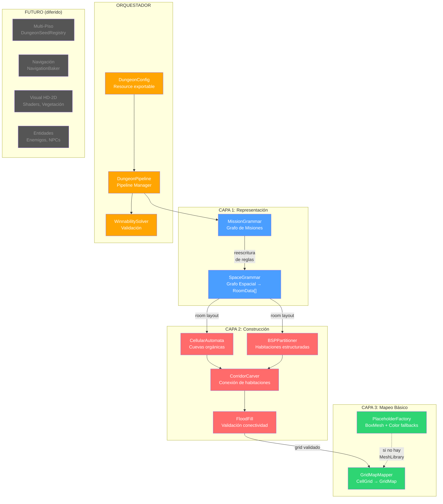

# Generador Procedural de Mazmorras — Plan de Implementación v2

## Resumen Ejecutivo

Módulo de generación procedural de mazmorras subterráneas para **Dungeon Divers** (Godot 4.6, Forward Plus, Jolt Physics, D3D12). GDScript puro. Cámara isométrica ortográfica. Grid configurable (32×32 / 64×64). **Enfoque 100% funcional** — sin shaders, sin vegetación, sin post-procesado en esta fase.

El sistema implementa el marco de tres capas — **Representación → Construcción → Mapeo** — con control basado en gameplay mediante gramáticas de misiones, garantizando mazmorras "ganables" antes de comprometer geometría.

> [!IMPORTANT]
> **Filosofía de esta versión**: Producir mazmorras lógicamente correctas, jugables y renderizadas con geometría básica en GridMap. Todo lo visual (texturas, shaders, vegetación, iluminación estilizada) queda **explícitamente diferido** con puntos de extensión claros.

---

## Decisiones de Arquitectura Confirmadas

| Decisión | Resolución |
|---|---|
| **Lenguaje Core Logic** | GDScript puro — óptimo para iteración y mantenimiento futuro |
| **Tamaño de Grid** | Configurable: 32×32 y 64×64 (con soporte para valores arbitrarios) |
| **Cámara** | Isométrica ortográfica |
| **Visual** | **Sin shaders, sin fog, sin texturas propias** — se usan placeholders (BoxMesh con ColorMaterial) hasta que el usuario provea assets |
| **MeshLibrary** | No existe aún — el módulo funciona con placeholders y permite asignar assets después |
| **Cerraduras/Llaves** | Genérico (llave → abre puerta → se consume). Plantado pero no es foco de esta fase |
| **Multi-piso** | Contemplado: seed registry para persistencia. Implementación profunda diferida |
| **Navegación** | Contemplado como punto de extensión futuro. No se implementa NavigationRegion3D |

---

## Assets Requeridos (Lista para el Usuario)

> [!IMPORTANT]
> **El módulo funciona sin estos assets** usando placeholders automáticos (cajas de colores). Cuando los tengas listos, se asignan vía el `BiomeProfile` Resource en el Inspector. Cada ítem indica el uso exacto y las dimensiones esperadas en unidades de celda.

| # | Asset | Tipo | Uso en el Sistema | Dimensión Base |
|---|---|---|---|---|
| 1 | **Tile de Suelo** | Mesh (.obj/.glb) | Celda transitable del GridMap | 1×1×0.1 (ancho × profundo × alto) |
| 2 | **Tile de Muro** | Mesh (.obj/.glb) | Celda sólida (se apila verticalmente 1-3 unidades) | 1×1×1 |
| 3 | **Tile de Muro Esquina** | Mesh (.obj/.glb) | Intersección de 2 muros en ángulo de 90° | 1×1×1 |
| 4 | **Tile de Muro Borde** | Mesh (.obj/.glb) | Borde superior del muro (coronamiento) | 1×1×0.3 |
| 5 | **Puerta Normal** | Mesh (.obj/.glb) | Conexión entre habitaciones | 1×1×1.5 |
| 6 | **Puerta Bloqueada** | Mesh (.obj/.glb) | Puerta que requiere llave genérica | 1×1×1.5 |
| 7 | **Escalera Descendente** | Mesh (.obj/.glb) | Transición al siguiente piso (bajada) | 1×1×1 |
| 8 | **Escalera Ascendente** | Mesh (.obj/.glb) | Retorno al piso anterior (subida) | 1×1×1 |
| 9 | **Tile de Suelo Corredor** | Mesh (.obj/.glb) | Diferenciación visual de pasillos (opcional, usa #1 si no existe) | 1×1×0.1 |
| 10 | **Marcador de Spawn** | Mesh (.obj/.glb) | Indicador visual de punto de aparición del jugador (temporal/debug) | 0.5×0.5×0.1 |
| 11 | **Marcador de Objetivo** | Mesh (.obj/.glb) | Indicador visual de objetivo de misión (temporal/debug) | 0.5×0.5×0.5 |
| 12 | **Marcador de Cofre/Tesoro** | Mesh (.obj/.glb) | Ubicación de loot (temporal/debug) | 0.5×0.5×0.5 |

> [!TIP]
> **Dimensiones**: Todas basadas en `cell_size` del `DungeonConfig` (default: 2.0 metros). Un tile de 1×1 en la tabla ocupa `cell_size × cell_size` metros en el mundo. El módulo escala automáticamente.

> [!NOTE]
> **Mientras no tengas assets**, el módulo genera automáticamente `BoxMesh` con `StandardMaterial3D` de colores diferenciados por tipo de celda:
> - Suelo → gris oscuro `#2d2d2d`
> - Muro → gris claro `#6b6b6b`
> - Puerta → marrón `#8b5e3c`
> - Puerta bloqueada → rojo oscuro `#8b3c3c`
> - Escaleras → azul `#3c5e8b`
> - Spawn → verde `#3c8b5e`
> - Objetivo → dorado `#d4a017`

---

## Arquitectura del Sistema



---

## Estructura de Directorios

```
res://
├── src/
│   └── dungeon_generator/
│       ├── core/                              # Lógica pura — CERO dependencias de nodos Godot
│       │   ├── data/
│       │   │   ├── cell_grid.gd               # Matriz 2D flat (PackedInt32Array)
│       │   │   ├── dungeon_graph.gd           # Grafo dirigido genérico
│       │   │   ├── room_data.gd               # Struct de habitación
│       │   │   └── mission_node.gd            # Struct de nodo de misión
│       │   ├── grammars/
│       │   │   ├── mission_grammar.gd         # Motor de reescritura de misiones
│       │   │   ├── space_grammar.gd           # Misión → Layout de habitaciones
│       │   │   └── grammar_rules.gd           # Catálogo de reglas de producción
│       │   ├── algorithms/
│       │   │   ├── cellular_automata.gd       # Generador de cuevas
│       │   │   ├── bsp_partitioner.gd         # Partición binaria del espacio
│       │   │   ├── corridor_carver.gd         # Tallado de corredores
│       │   │   └── flood_fill.gd              # Validación de conectividad
│       │   ├── solvers/
│       │   │   ├── winnability_solver.gd      # Verificador de ganabilidad
│       │   │   └── fitness_evaluator.gd       # Evaluador de calidad
│       │   └── dungeon_pipeline.gd            # Orquestador completo (sin nodos)
│       │
│       ├── render/                            # Depende de nodos Godot
│       │   ├── gridmap_mapper.gd              # CellGrid → GridMap
│       │   ├── placeholder_factory.gd         # Genera BoxMesh+Color si no hay MeshLibrary
│       │   └── chunk_manager.gd               # Activación/desactivación por chunks
│       │
│       ├── config/
│       │   ├── dungeon_config.gd              # Resource principal (exportable)
│       │   ├── biome_profile.gd               # Perfil de assets (MeshLibrary + mapeo)
│       │   └── difficulty_curve.gd            # Curva dificultad → profundidad de grafo
│       │
│       ├── persistence/                       # Multi-piso (estructura base, implementación futura)
│       │   └── dungeon_seed_registry.gd       # Registro seed ↔ piso para consistencia
│       │
│       └── debug/
│           ├── dungeon_visualizer.gd          # Overlay 2D del grafo y grid
│           └── generation_profiler.gd         # Métricas de rendimiento
│
├── scenes/
│   └── dungeon/
│       ├── dungeon_level.tscn                 # Escena principal del nivel
│       └── dungeon_debug_view.tscn            # Vista debug con overlay
│
├── resources/
│   └── configs/
│       ├── cave_dungeon.tres                  # Preset: cueva orgánica (CA)
│       ├── castle_dungeon.tres                # Preset: castillo (BSP)
│       └── hybrid_dungeon.tres                # Preset: híbrido CA + BSP
│
└── tests/
    ├── test_cell_grid.gd
    ├── test_mission_grammar.gd
    ├── test_flood_fill.gd
    ├── test_winnability.gd
    └── test_pipeline_integration.gd
```

---

## Proposed Changes

### Fase 1: Modelos de Datos Puros

> **Objetivo**: Abstracciones de datos que todo el sistema consume. Cero dependencias de nodos Godot. Todo hereda de `RefCounted` para máxima ligereza.

---

#### [NEW] [`cell_grid.gd`](file:///c:/Users/olivereld/Documents/dungeon-divers/src/dungeon_generator/core/data/cell_grid.gd)

Matriz 2D flat — el corazón de datos del sistema.

```gdscript
class_name CellGrid
extends RefCounted

enum CellType {
    VOID = -1,         # Fuera de límites
    WALL = 0,          # Muro sólido
    FLOOR = 1,         # Suelo transitable
    DOOR = 2,          # Puerta normal
    LOCKED_DOOR = 3,   # Puerta que requiere llave (genérica)
    STAIRS_DOWN = 4,   # Pasaje al siguiente piso (descenso)
    STAIRS_UP = 5,     # Retorno al piso anterior (ascenso)
    SPAWN = 6,         # Punto de aparición del jugador
    OBJECTIVE = 7,     # Objetivo de misión
    CORRIDOR = 8,      # Suelo de corredor (distinción lógica, mismo behavior que FLOOR)
}

var width: int
var height: int
var _cells: PackedInt32Array       # Flat: index = y * width + x
var _metadata: Dictionary          # Vector2i → Dictionary

func _init(w: int, h: int, default: CellType = CellType.WALL) -> void
func get_cell(pos: Vector2i) -> CellType
func set_cell(pos: Vector2i, type: CellType) -> void
func is_in_bounds(pos: Vector2i) -> bool
func is_walkable(pos: Vector2i) -> bool       # FLOOR, DOOR, CORRIDOR, STAIRS, SPAWN, OBJECTIVE
func get_neighbors_4(pos: Vector2i) -> Array[Vector2i]
func get_neighbors_8(pos: Vector2i) -> Array[Vector2i]
func count_neighbors(pos: Vector2i, type: CellType, use_8: bool = true) -> int
func count_walkable_neighbors(pos: Vector2i, use_8: bool = true) -> int
func set_metadata(pos: Vector2i, key: String, value: Variant) -> void
func get_metadata(pos: Vector2i, key: String) -> Variant
func find_cells_of_type(type: CellType) -> Array[Vector2i]
func duplicate_grid() -> CellGrid
func get_bounds() -> Rect2i
```

**Diseño**: `PackedInt32Array` flat para iteración en O(1) por celda. Los Autómatas Celulares hacen millones de lecturas por generación — esto importa.

---

#### [NEW] [`dungeon_graph.gd`](file:///c:/Users/olivereld/Documents/dungeon-divers/src/dungeon_generator/core/data/dungeon_graph.gd)

Grafo dirigido genérico. Usado tanto para el grafo de misiones como para el grafo espacial.

```gdscript
class_name DungeonGraph
extends RefCounted

var _nodes: Dictionary        # int id → {type: StringName, data: Dictionary}
var _adjacency: Dictionary    # int id → Array[int] (successors)
var _reverse: Dictionary      # int id → Array[int] (predecessors)
var _next_id: int = 0

func add_node(type: StringName, data: Dictionary = {}) -> int
func remove_node(id: int) -> void
func add_edge(from_id: int, to_id: int, data: Dictionary = {}) -> void
func remove_edge(from_id: int, to_id: int) -> void
func has_node(id: int) -> bool
func has_edge(from_id: int, to_id: int) -> bool
func get_node_type(id: int) -> StringName
func get_node_data(id: int) -> Dictionary
func set_node_data(id: int, key: String, value: Variant) -> void
func get_successors(id: int) -> Array[int]
func get_predecessors(id: int) -> Array[int]
func get_all_node_ids() -> Array[int]
func find_nodes_by_type(type: StringName) -> Array[int]
func get_node_count() -> int
func get_edge_count() -> int

# Operaciones de grafo para gramáticas
func find_matching_subgraph(pattern: Array[Dictionary]) -> Array[Dictionary]
func replace_subgraph(match_result: Dictionary, replacement: Dictionary) -> void
func get_topological_order() -> Array[int]
func is_reachable(from_id: int, to_id: int) -> bool     # BFS
func get_shortest_path(from_id: int, to_id: int) -> Array[int]
func duplicate_graph() -> DungeonGraph
```

---

#### [NEW] [`room_data.gd`](file:///c:/Users/olivereld/Documents/dungeon-divers/src/dungeon_generator/core/data/room_data.gd)

Descriptor de una habitación individual.

```gdscript
class_name RoomData
extends RefCounted

var id: int
var rect: Rect2i                       # Bounding box en coordenadas de grid
var room_type: StringName              # &"combat", &"puzzle", &"treasure", &"boss", &"corridor", &"start", &"goal"
var mission_node_id: int = -1          # Referencia al nodo de misión que representa
var connections: Array[Vector2i]       # Celdas de puerta/conexión
var connected_room_ids: Array[int]     # IDs de habitaciones conectadas
var is_required: bool = true           # ¿Parte del camino crítico?
var depth_in_graph: int = 0            # Profundidad desde START (para dificultad progresiva)

func get_center() -> Vector2i
func get_area() -> int
func overlaps(other: RoomData) -> bool
func expanded(margin: int) -> Rect2i   # Para detección de colisión con margen
```

---

#### [NEW] [`mission_node.gd`](file:///c:/Users/olivereld/Documents/dungeon-divers/src/dungeon_generator/core/data/mission_node.gd)

Nodo semántico del grafo de misiones. El sistema de llaves es genérico: `key_type` string → abre `lock_type` string.

```gdscript
class_name MissionNode
extends RefCounted

enum ActionType {
    START,              # Punto de inicio
    EXPLORE,            # Explorar área
    FIND_KEY,           # Encontrar llave genérica
    UNLOCK,             # Desbloquear puerta/celda genérica
    COMBAT,             # Encuentro de combate
    MINI_BOSS,          # Mini-jefe
    BOSS,               # Jefe principal
    PUZZLE,             # Puzzle ambiental
    TREASURE,           # Cofre de tesoro
    GOAL,               # Objetivo final del nivel
    PASSAGE_DOWN,       # Pasaje al siguiente piso (futuro)
}

var action: ActionType
var required_items: Array[StringName]      # e.g. [&"cell_key"] — ítems para poder completar
var grants_items: Array[StringName]        # e.g. [&"cell_key"] — ítems que otorga al completar
var difficulty_weight: float = 1.0
var is_optional: bool = false
var room_type_hint: StringName = &""       # Sugerencia de tipo de habitación

## Sistema genérico de lock/key:
## FIND_KEY node: grants_items = [&"cell_key"]
## UNLOCK node: required_items = [&"cell_key"]
## Al resolver UNLOCK, el ítem se CONSUME del inventario simulado.
```

---

### Fase 2: Motor de Gramáticas (Mission → Space)

> **Objetivo**: Grafo de misiones dictado por reglas de producción → layout de habitaciones posicionadas.

---

#### [NEW] [`grammar_rules.gd`](file:///c:/Users/olivereld/Documents/dungeon-divers/src/dungeon_generator/core/grammars/grammar_rules.gd)

Catálogo de reglas de producción (find-and-replace sobre subgrafos).

```gdscript
class_name GrammarRules
extends RefCounted

## Cada regla:
## {
##   "name": StringName,
##   "weight": float,            # Probabilidad relativa
##   "lhs": Array[Dictionary],   # Patrón a buscar
##   "lhs_edges": Array,         # Aristas del patrón
##   "rhs": Array[Dictionary],   # Reemplazo
##   "rhs_edges": Array          # Aristas del reemplazo
## }

static func get_mission_rules() -> Array[Dictionary]
static func get_space_rules() -> Array[Dictionary]
```

**Reglas de misión incluidas en v1**:

| Regla | LHS | RHS | Efecto | Peso |
|---|---|---|---|---|
| `linear_task` | `A → B` | `A → [EXPLORE] → B` | Inserta exploración intermedia | 1.0 |
| `lock_and_key` | `A → B` | `A → [FIND_KEY] → [UNLOCK] → B` | Dependencia llave-cerradura genérica | 0.8 |
| `branch_optional` | `A → B` | `A → B` + `A → [TREASURE] → B` | Rama de tesoro opcional | 0.5 |
| `combat_gate` | `[EXPLORE]` | `[COMBAT] → [EXPLORE]` | Antepone combate | 0.7 |
| `boss_finisher` | `[TASK] → [GOAL]` | `[TASK] → [BOSS] → [GOAL]` | Jefe antes del objetivo | 0.3 |

> [!NOTE]
> Las reglas son datos, no código. Se pueden añadir nuevas reglas sin tocar el motor de reescritura. Los pesos controlan la frecuencia relativa de cada regla — ajustable desde `DungeonConfig`.

---

#### [NEW] [`mission_grammar.gd`](file:///c:/Users/olivereld/Documents/dungeon-divers/src/dungeon_generator/core/grammars/mission_grammar.gd)

Motor de reescritura iterativo.

```gdscript
class_name MissionGrammar
extends RefCounted

var _rng: RandomNumberGenerator
var _rules: Array[Dictionary]

## Genera el grafo de misiones:
## 1. Crear grafo semilla: START → GOAL
## 2. Loop: seleccionar regla (ruleta ponderada) → find matching subgraph → apply
## 3. Validar winnability tras cada rewrite (reject si rompe resolubilidad)
## 4. Terminar al alcanzar target_depth o max_iterations
func generate(config: DungeonConfig) -> DungeonGraph

func _select_rule(applicable: Array[Dictionary]) -> Dictionary
func _apply_rule(graph: DungeonGraph, rule: Dictionary, match: Dictionary) -> bool
func _validate_after_rewrite(graph: DungeonGraph) -> bool
```

**Flujo de generación** (ejemplo con `mission_depth = 4`):
```
Iter 0: START ───────────────────────── GOAL
Iter 1: START → EXPLORE ─────────────── GOAL             [linear_task]
Iter 2: START → FIND_KEY → UNLOCK → EXPLORE → GOAL       [lock_and_key]
Iter 3: START → FIND_KEY → UNLOCK → COMBAT → EXPLORE → GOAL  [combat_gate]
Iter 4: START → FIND_KEY → UNLOCK → COMBAT → EXPLORE → BOSS → GOAL  [boss_finisher]
                                                └── TREASURE (opt) ─┘  [branch_optional]
```

---

#### [NEW] [`space_grammar.gd`](file:///c:/Users/olivereld/Documents/dungeon-divers/src/dungeon_generator/core/grammars/space_grammar.gd)

Traduce el grafo de misiones en habitaciones posicionadas sin solapamiento.

```gdscript
class_name SpaceGrammar
extends RefCounted

## Transforma grafo de misión → Array[RoomData] posicionadas.
## 1. Asignar room_type según ActionType
## 2. Calcular dimensiones por tipo (BOSS = grande, CORRIDOR = estrecho)
## 3. Colocar con detección de colisiones (espiral desde centro)
## 4. Registrar puntos de conexión entre habitaciones adyacentes en el grafo
func generate(mission_graph: DungeonGraph, config: DungeonConfig) -> Array[RoomData]

func _size_for_type(type: StringName, difficulty: float) -> Vector2i
func _place_room(room: RoomData, placed: Array[RoomData], grid_bounds: Rect2i) -> bool
func _find_connection_points(room_a: RoomData, room_b: RoomData) -> Array[Vector2i]
```

**Tabla de dimensiones por tipo** (en celdas, escaladas por `difficulty`):

| room_type | Min Size | Max Size | Notas |
|---|---|---|---|
| `start` | 5×5 | 7×7 | Zona segura, spawn del jugador |
| `explore` | 6×6 | 10×10 | Exploración general |
| `combat` | 7×7 | 12×12 | Espacio para maniobras |
| `boss` | 10×10 | 16×16 | Arena amplia |
| `treasure` | 4×4 | 6×6 | Compacta, recompensa |
| `puzzle` | 5×5 | 8×8 | Mecánica ambiental |
| `goal` | 5×5 | 7×7 | Objetivo final |

---

### Fase 3: Algoritmos de Construcción

> **Objetivo**: Esculpir el `CellGrid` basado en el layout de habitaciones.

---

#### [NEW] [`cellular_automata.gd`](file:///c:/Users/olivereld/Documents/dungeon-divers/src/dungeon_generator/core/algorithms/cellular_automata.gd)

Genera texturas orgánicas de cuevas dentro de los bounds de cada habitación.

```gdscript
class_name CellularAutomata
extends RefCounted

var initial_fill_chance: float = 0.45
var birth_limit: int = 4
var death_limit: int = 3
var iterations: int = 5
var smooth_edges: bool = true

## Aplica CA dentro de 'bounds' del CellGrid.
## Respeta los bordes como muros fijos.
func apply(grid: CellGrid, bounds: Rect2i, rng: RandomNumberGenerator) -> void

## Una pasada del autómata (regla B4/S3 Moore neighborhood)
func _step(grid: CellGrid, bounds: Rect2i) -> CellGrid
```

---

#### [NEW] [`bsp_partitioner.gd`](file:///c:/Users/olivereld/Documents/dungeon-divers/src/dungeon_generator/core/algorithms/bsp_partitioner.gd)

Habitaciones rectangulares limpias via partición binaria.

```gdscript
class_name BSPPartitioner
extends RefCounted

var min_room_size: Vector2i = Vector2i(6, 6)
var max_room_size: Vector2i = Vector2i(16, 16)
var min_split_ratio: float = 0.35
var max_split_ratio: float = 0.65
var max_depth: int = 5

## Particiona el área y genera habitaciones en cada hoja.
func partition(grid: CellGrid, area: Rect2i, rng: RandomNumberGenerator) -> Array[RoomData]

## Nodo interno del BSP tree
func _split_recursive(area: Rect2i, depth: int, rng: RandomNumberGenerator) -> Array[Rect2i]
```

---

#### [NEW] [`corridor_carver.gd`](file:///c:/Users/olivereld/Documents/dungeon-divers/src/dungeon_generator/core/algorithms/corridor_carver.gd)

Talla corredores entre habitaciones conectadas.

```gdscript
class_name CorridorCarver
extends RefCounted

enum Style { L_SHAPED, STRAIGHT, ORGANIC }

var style: Style = Style.L_SHAPED
var width: int = 2
var wiggle: float = 0.2           # Solo para ORGANIC

func carve(grid: CellGrid, from: Vector2i, to: Vector2i, rng: RandomNumberGenerator) -> void
func _carve_l_shaped(grid: CellGrid, from: Vector2i, to: Vector2i, h_first: bool) -> void
func _carve_straight(grid: CellGrid, from: Vector2i, to: Vector2i) -> void
func _carve_organic(grid: CellGrid, from: Vector2i, to: Vector2i, rng: RandomNumberGenerator) -> void
```

---

#### [NEW] [`flood_fill.gd`](file:///c:/Users/olivereld/Documents/dungeon-divers/src/dungeon_generator/core/algorithms/flood_fill.gd)

**Componente de seguridad crítico** — garantiza que no existan zonas inalcanzables.

```gdscript
class_name FloodFill
extends RefCounted

## Identifica regiones conectadas (stack-based, no recursivo)
func find_all_regions(grid: CellGrid) -> Array    # Array de Array[Vector2i]

## Conecta regiones aisladas a la principal vía corredor mínimo
func ensure_connectivity(grid: CellGrid, carver: CorridorCarver, rng: RandomNumberGenerator) -> int

## Verifica que SPAWN → OBJECTIVE sea alcanzable
func verify_critical_path(grid: CellGrid) -> bool

## Encuentra el par de celdas más cercano entre dos regiones
func _find_closest_pair(region_a: Array[Vector2i], region_b: Array[Vector2i]) -> Array[Vector2i]
```

---

### Fase 4: Solvers y Validación

> **Objetivo**: Garantizar que toda mazmorra generada es completable.

---

#### [NEW] [`winnability_solver.gd`](file:///c:/Users/olivereld/Documents/dungeon-divers/src/dungeon_generator/core/solvers/winnability_solver.gd)

Simulación abstracta del jugador sobre el grafo de misiones.

```gdscript
class_name WinnabilitySolver
extends RefCounted

class ValidationResult extends RefCounted:
    var is_winnable: bool
    var critical_path: Array[int]             # Nodos del camino óptimo
    var unreachable_nodes: Array[int]         # Nodos imposibles de alcanzar
    var missing_items: Array[StringName]      # Ítems requeridos pero nunca otorgados
    var estimated_length: int                 # Pasos mínimos

## BFS con inventario simulado:
## 1. Comenzar en START con inventario vacío
## 2. En cada nodo: ¿required_items ⊆ inventario_actual?
## 3. Si sí → añadir grants_items, CONSUMIR required_items (llaves genéricas)
## 4. Continuar hasta GOAL o agotar opciones
func validate(graph: DungeonGraph) -> ValidationResult
```

> [!IMPORTANT]
> **Consumo de llaves**: Cuando un nodo `UNLOCK` requiere `&"cell_key"` y el inventario lo tiene, la llave se **remueve** del inventario simulado. Esto modela el comportamiento descrito: "llave abre puerta y se consume".

---

#### [NEW] [`fitness_evaluator.gd`](file:///c:/Users/olivereld/Documents/dungeon-divers/src/dungeon_generator/core/solvers/fitness_evaluator.gd)

Evaluador de calidad (usado para aceptar/rechazar generaciones).

```gdscript
class_name FitnessEvaluator
extends RefCounted

## Score normalizado [0.0, 1.0]
func evaluate(grid: CellGrid, rooms: Array[RoomData], config: DungeonConfig) -> float:
    # 30% — conectividad (0 regiones aisladas = 1.0)
    # 25% — variedad de habitaciones (distribución de tamaños)
    # 20% — ratio suelo/muro (evitar mazmorras vacías o atestadas)
    # 25% — longitud del camino crítico vs total (pacing)
```

---

### Fase 5: Pipeline, Configuración y Persistencia

> **Objetivo**: Unificar todo en un pipeline controlado por Resources exportables.

---

#### [NEW] [`dungeon_config.gd`](file:///c:/Users/olivereld/Documents/dungeon-divers/src/dungeon_generator/config/dungeon_config.gd)

Resource principal — todo se controla desde el Inspector de Godot.

```gdscript
class_name DungeonConfig
extends Resource

@export_group("Dimensiones")
@export_range(16, 128, 1) var grid_width: int = 64
@export_range(16, 128, 1) var grid_height: int = 64
@export var cell_size: float = 2.0              # Metros por celda
@export_range(1, 4, 1) var wall_height: int = 2 # Celdas de alto por muro

@export_group("Semilla")
@export var seed: int = 0                        # 0 = aleatorio
@export var use_fixed_seed: bool = false

@export_group("Gramática de Misión")
@export_range(2, 10) var mission_depth: int = 5
@export_range(5, 50) var max_grammar_iterations: int = 20
@export var lock_key_frequency: float = 0.3
@export var optional_branch_chance: float = 0.2
@export var boss_enabled: bool = true

@export_group("Algoritmo")
@export_enum("CellularAutomata", "BSP", "Hybrid") var algorithm: String = "Hybrid"
@export var ca_fill_chance: float = 0.45
@export_range(1, 10) var ca_iterations: int = 5
@export var bsp_min_room: Vector2i = Vector2i(6, 6)
@export var bsp_max_room: Vector2i = Vector2i(16, 16)

@export_group("Corredores")
@export_enum("L-Shaped", "Straight", "Organic") var corridor_style: String = "L-Shaped"
@export_range(1, 4) var corridor_width: int = 2

@export_group("Dificultad")
@export_range(0.0, 2.0, 0.1) var difficulty: float = 1.0
@export var difficulty_curve: Curve

@export_group("Assets")
@export var biome_profile: BiomeProfile         # Asignar cuando se tengan assets

@export_group("Multi-Piso (Futuro)")
@export var floor_number: int = 1               # Piso actual
@export var max_floors: int = 5
@export var passage_chance: float = 0.15        # Probabilidad de generar pasaje
```

---

#### [NEW] [`biome_profile.gd`](file:///c:/Users/olivereld/Documents/dungeon-divers/src/dungeon_generator/config/biome_profile.gd)

Perfil de assets — permite asignar meshes cuando estén disponibles. Si no se asigna, el sistema usa placeholders.

```gdscript
class_name BiomeProfile
extends Resource

@export_group("MeshLibrary")
@export var mesh_library: MeshLibrary           # null = usar placeholders automáticos

@export_group("Mapeo de Tiles (índices en MeshLibrary)")
@export var floor_index: int = 0
@export var wall_index: int = 1
@export var wall_corner_index: int = 2
@export var wall_cap_index: int = 3
@export var door_index: int = 4
@export var locked_door_index: int = 5
@export var stairs_down_index: int = 6
@export var stairs_up_index: int = 7
@export var corridor_index: int = -1            # -1 = usar floor_index
@export var spawn_marker_index: int = -1        # -1 = no colocar marker
@export var objective_marker_index: int = -1

@export_group("Colores Placeholder")
@export var floor_color: Color = Color("#2d2d2d")
@export var wall_color: Color = Color("#6b6b6b")
@export var door_color: Color = Color("#8b5e3c")
@export var locked_door_color: Color = Color("#8b3c3c")
@export var stairs_color: Color = Color("#3c5e8b")
@export var spawn_color: Color = Color("#3c8b5e")
@export var objective_color: Color = Color("#d4a017")

## ¿Tiene MeshLibrary asignada o debe usar placeholders?
func has_custom_assets() -> bool:
    return mesh_library != null
```

---

#### [NEW] [`dungeon_seed_registry.gd`](file:///c:/Users/olivereld/Documents/dungeon-divers/src/dungeon_generator/persistence/dungeon_seed_registry.gd)

**Estructura base para multi-piso**. Asegura que el mismo piso siempre genere la misma mazmorra.

```gdscript
class_name DungeonSeedRegistry
extends RefCounted

## Registro: dungeon_id + floor_number → seed determinista.
## Si el jugador baja al piso 2, se registra el seed usado.
## Si vuelve al piso 2, se recupera el MISMO seed → misma mazmorra.
var _registry: Dictionary = {}    # "dungeon_id:floor" → int seed

## Obtiene o genera un seed para un piso específico.
## Si ya existe, retorna el mismo (consistencia).
## Si no existe, genera uno nuevo y lo registra.
func get_or_create_seed(dungeon_id: StringName, floor_number: int, master_seed: int) -> int:
    var key := "%s:%d" % [dungeon_id, floor_number]
    if _registry.has(key):
        return _registry[key]
    # Derivar seed determinista del master_seed + floor_number
    var rng := RandomNumberGenerator.new()
    rng.seed = master_seed + floor_number * 7919  # primo para distribución
    var floor_seed := rng.randi()
    _registry[key] = floor_seed
    return floor_seed

func has_seed(dungeon_id: StringName, floor_number: int) -> bool
func clear_dungeon(dungeon_id: StringName) -> void      # Resetear un dungeon completo
func serialize() -> Dictionary                           # Para save/load
func deserialize(data: Dictionary) -> void
```

> [!NOTE]
> **Consistencia multi-piso**: El seed de cada piso se deriva del `master_seed` de forma determinista (`master_seed + floor * 7919`). Esto garantiza que regenerar el piso 2 siempre produce el mismo layout. El registry persiste los seeds para el save/load del juego.

---

#### [NEW] [`dungeon_pipeline.gd`](file:///c:/Users/olivereld/Documents/dungeon-divers/src/dungeon_generator/core/dungeon_pipeline.gd)

Orquestador central.

```gdscript
class_name DungeonPipeline
extends RefCounted

signal generation_started
signal phase_completed(phase_name: String, elapsed_ms: float)
signal generation_completed(result: DungeonResult)
signal generation_failed(error: String)

class DungeonResult extends RefCounted:
    var grid: CellGrid
    var mission_graph: DungeonGraph
    var rooms: Array[RoomData]
    var validation: WinnabilitySolver.ValidationResult
    var fitness_score: float
    var seed_used: int
    var floor_number: int
    var generation_time_ms: float

## Ejecuta el pipeline completo. Retorna DungeonResult o null tras max_retries.
func generate(config: DungeonConfig, max_retries: int = 5) -> DungeonResult:
    # FASE 1: Resolver seed (via DungeonSeedRegistry si multi-piso)
    # FASE 2: MissionGrammar.generate() → DungeonGraph
    # FASE 3: WinnabilitySolver.validate() → retry si !is_winnable
    # FASE 4: SpaceGrammar.generate() → Array[RoomData]
    # FASE 5: Algoritmo (CA/BSP/Hybrid) → rellenar CellGrid
    # FASE 6: CorridorCarver → conectar habitaciones en grid
    # FASE 7: FloodFill.ensure_connectivity() → parchar regiones aisladas
    # FASE 8: FloodFill.verify_critical_path() → última validación
    # FASE 9: FitnessEvaluator → score de calidad
    # FASE 10: Empaquetar DungeonResult
    ...
```

---

### Fase 6: Capa de Renderizado Básico

> **Objetivo**: Traducir `DungeonResult` en geometría visible con GridMap. Sin shaders, sin texturas — funcionalidad pura.

---

#### [NEW] [`placeholder_factory.gd`](file:///c:/Users/olivereld/Documents/dungeon-divers/src/dungeon_generator/render/placeholder_factory.gd)

Genera una MeshLibrary temporal con BoxMesh de colores si no hay assets.

```gdscript
class_name PlaceholderFactory
extends RefCounted

## Crea una MeshLibrary con BoxMesh por cada CellType.
## Cada mesh tiene un StandardMaterial3D con el color del BiomeProfile.
func create_placeholder_library(biome: BiomeProfile, cell_size: float) -> MeshLibrary:
    var lib := MeshLibrary.new()
    
    # Suelo: caja plana
    _add_tile(lib, 0, Vector3(cell_size, 0.1, cell_size), biome.floor_color)
    # Muro: cubo completo
    _add_tile(lib, 1, Vector3(cell_size, cell_size, cell_size), biome.wall_color)
    # Puerta: caja con hendidura visual
    _add_tile(lib, 4, Vector3(cell_size, cell_size * 0.8, cell_size * 0.3), biome.door_color)
    # ... etc para cada tipo
    
    return lib

func _add_tile(lib: MeshLibrary, index: int, size: Vector3, color: Color) -> void:
    var mesh := BoxMesh.new()
    mesh.size = size
    var mat := StandardMaterial3D.new()
    mat.albedo_color = color
    mesh.material = mat
    lib.set_item_mesh(index, mesh)
    lib.set_item_name(index, CellGrid.CellType.keys()[index])
```

---

#### [NEW] [`gridmap_mapper.gd`](file:///c:/Users/olivereld/Documents/dungeon-divers/src/dungeon_generator/render/gridmap_mapper.gd)

Consume el `CellGrid` y lo materializa en GridMap.

```gdscript
class_name GridMapMapper
extends Node

@export var grid_map: GridMap

var _placeholder_factory := PlaceholderFactory.new()

## Traduce el CellGrid completo al GridMap.
## Si BiomeProfile no tiene MeshLibrary, genera placeholders.
func apply(grid: CellGrid, config: DungeonConfig) -> void:
    grid_map.clear()
    
    var biome := config.biome_profile
    if biome == null:
        biome = BiomeProfile.new()    # defaults
    
    if biome.has_custom_assets():
        grid_map.mesh_library = biome.mesh_library
    else:
        grid_map.mesh_library = _placeholder_factory.create_placeholder_library(biome, config.cell_size)
    
    grid_map.cell_size = Vector3(config.cell_size, config.cell_size, config.cell_size)
    
    for x in range(grid.width):
        for z in range(grid.height):
            var cell_type := grid.get_cell(Vector2i(x, z))
            var tile_index := _cell_type_to_tile_index(cell_type, biome)
            if tile_index < 0:
                continue
            
            var orientation := _calculate_wall_orientation(grid, Vector2i(x, z))
            
            if cell_type == CellGrid.CellType.WALL:
                for y in range(config.wall_height):
                    grid_map.set_cell_item(Vector3i(x, y, z), tile_index, orientation)
            else:
                grid_map.set_cell_item(Vector3i(x, 0, z), tile_index, orientation)

func _cell_type_to_tile_index(type: CellGrid.CellType, biome: BiomeProfile) -> int
func _calculate_wall_orientation(grid: CellGrid, pos: Vector2i) -> int
```

---

#### [NEW] [`chunk_manager.gd`](file:///c:/Users/olivereld/Documents/dungeon-divers/src/dungeon_generator/render/chunk_manager.gd)

División en chunks para optimización.

```gdscript
class_name ChunkManager
extends Node3D

@export var chunk_size: int = 16
@export var render_distance: int = 3

var _chunks: Dictionary = {}                # Vector2i → Node3D
var _player_chunk: Vector2i = Vector2i.ZERO

func initialize(grid: CellGrid, config: DungeonConfig) -> void
func update_active_chunks(player_pos: Vector3) -> void
func _activate_chunk(coord: Vector2i) -> void
func _deactivate_chunk(coord: Vector2i) -> void
```

---

### Fase Transversal: Debug y Testing

---

#### [NEW] [`dungeon_visualizer.gd`](file:///c:/Users/olivereld/Documents/dungeon-divers/src/dungeon_generator/debug/dungeon_visualizer.gd)

Overlay 2D que dibuja el grafo y el grid — esencial para iterar sin assets.

```gdscript
class_name DungeonVisualizer
extends Control

@export var cell_pixel_size: int = 4        # Píxeles por celda en el overlay

## Dibuja el CellGrid como una imagen de píxeles coloreados por tipo
func visualize_cell_grid(grid: CellGrid) -> void

## Dibuja el grafo de misiones como nodos circulares + aristas
func visualize_mission_graph(graph: DungeonGraph) -> void

## Dibuja los bounds de las habitaciones con labels
func visualize_rooms(rooms: Array[RoomData]) -> void

## Toggle visibilidad con tecla (default: F3)
func _input(event: InputEvent) -> void
```

> [!TIP]
> El visualizer es tu herramienta principal de iteración mientras no haya assets 3D. Muestra el grid como minimap coloreado y el grafo de misiones como diagrama de nodos.

---

#### [NEW] Tests unitarios en [`tests/`](file:///c:/Users/olivereld/Documents/dungeon-divers/tests/)

| Test | Qué Valida |
|---|---|
| `test_cell_grid.gd` | CRUD, bounds checking, neighbors, flat array consistency |
| `test_mission_grammar.gd` | Reglas de producción, determinismo con mismo seed |
| `test_flood_fill.gd` | Conectividad en grids conocidos, edge cases (grid vacío, todo muros) |
| `test_winnability.gd` | **1000 generaciones → 100% winnable** |
| `test_pipeline_integration.gd` | Pipeline end-to-end sin renderizado |

```bash
# Ejecutar todos los tests en modo headless
godot --headless --script res://tests/test_pipeline_integration.gd

# Stress test de winnability
godot --headless --script res://tests/test_winnability.gd -- --iterations=1000
```

---

## Extensiones Futuras (Explícitamente Diferidas)

Estos componentes están **diseñados en la arquitectura** pero **no se implementan en esta fase**:

| Extensión | Punto de Conexión | Cuándo |
|---|---|---|
| **Shaders HD-2D** (hierba, wall fade, billboard) | `MultiMeshPopulator`, `ShaderMaterial` en `GridMapMapper` | Cuando haya assets y la funcionalidad esté validada |
| **NavigationRegion3D** | `NavigationBaker` consume `CellGrid` post-generación | Cuando se implementen entidades/enemigos |
| **Multi-piso profundo** | `DungeonSeedRegistry` + `DungeonPipeline.floor_number` | Cuando el gameplay de un piso esté sólido |
| **Entidades (enemigos, NPCs)** | `RoomData.enemies`, `MissionNode.COMBAT` | Sistema de combate independiente |
| **Vegetación MultiMesh** | `MultiMeshPopulator` + shader de hierba | Fase visual |
| **Post-procesado** (DoF, bloom) | `WorldEnvironment` en `dungeon_level.tscn` | Fase visual |
| **Integración con terreno** | Entrada de la mazmorra = transición desde terreno procedural | Cuando ambos módulos estén funcionales |

---

## Verification Plan

### Automated Tests

```bash
godot --headless --script res://tests/test_pipeline_integration.gd
godot --headless --script res://tests/test_winnability.gd -- --iterations=1000
```

### Manual Verification

| Verificación | Criterio de Éxito |
|---|---|
| **Winnability** | 1000/1000 generaciones completables |
| **Conectividad** | 0 regiones aisladas por generación |
| **Rendimiento** | < 200ms para grid 64×64 |
| **Seeds consistentes** | Mismo seed → mismo layout (determinismo absoluto) |
| **Multi-tamaño** | Funciona correctamente en 32×32 y 64×64 |
| **Sin assets** | Placeholders visibles y diferenciables por color |
| **Con assets** | MeshLibrary asignada se usa correctamente |
| **Debug overlay** | Grid y grafo visibles como minimap 2D (F3) |
| **Config desde Inspector** | Todos los parámetros editables sin tocar código |

---

## Cronograma Estimado

| Fase | Días | Dependencias | Entregable |
|---|---|---|---|
| **F1**: Modelos de Datos | 2 | — | `CellGrid`, `DungeonGraph`, `RoomData`, `MissionNode` |
| **F2**: Motor de Gramáticas | 3-4 | F1 | `MissionGrammar`, `SpaceGrammar`, `GrammarRules` |
| **F3**: Algoritmos | 3-4 | F1 | `CellularAutomata`, `BSPPartitioner`, `CorridorCarver`, `FloodFill` |
| **F4**: Solvers | 1-2 | F2 | `WinnabilitySolver`, `FitnessEvaluator` |
| **F5**: Pipeline + Config | 2-3 | F1-F4 | `DungeonPipeline`, `DungeonConfig`, `BiomeProfile`, `SeedRegistry` |
| **F6**: Renderizado Básico | 2-3 | F5 | `GridMapMapper`, `PlaceholderFactory`, `ChunkManager` |
| **Debug + Tests** | 1-2 | F1-F6 | `DungeonVisualizer`, suite de tests headless |
| **Total** | **~14-18 días** | | Sistema funcional con placeholders |

> [!NOTE]
> F2 y F3 pueden ejecutarse en paralelo (ambas dependen solo de F1). Esto reduce el camino crítico a ~12 días.
